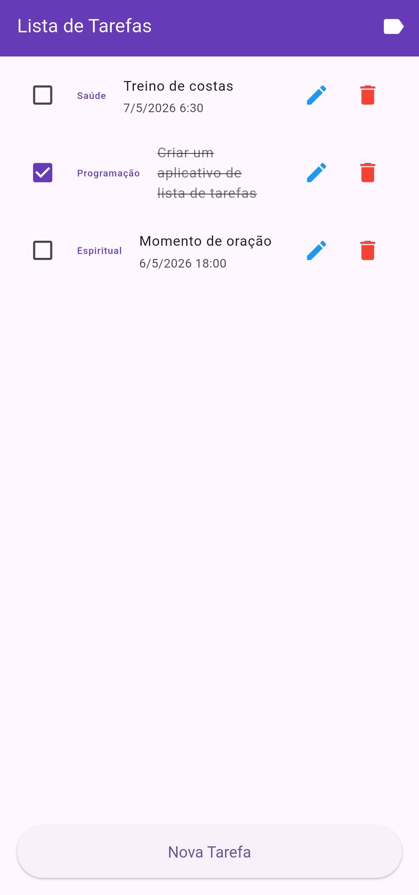
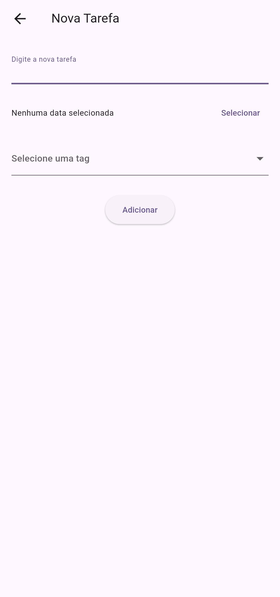
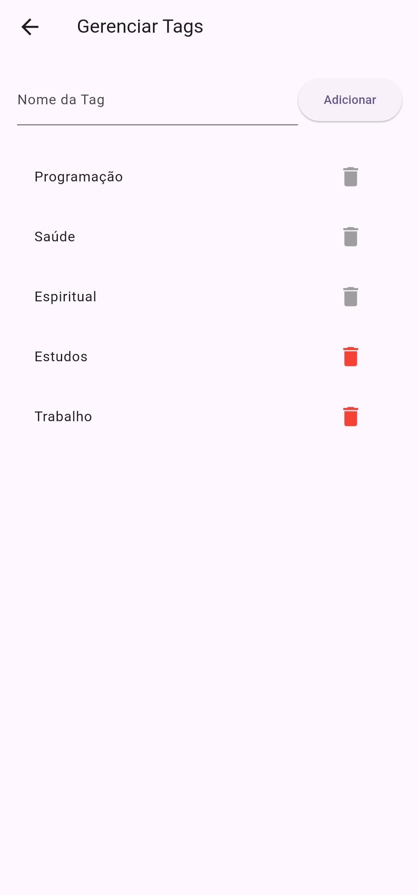

# 📱 Taskable App

A simple and efficient task manager with support for **custom tags** and **date/time scheduling**.

---

## 🚀 About the project

**Taskable** is a Flutter application designed to help users organize their daily tasks in a practical way.
This project was originally developed as part of a **college assignment**.
Users can create, edit, and delete tasks, categorize them with tags, and assign dates for better control.

---

## ✨ Features

* ✅ Create tasks
* ✏️ Edit tasks
* 🗑️ Delete tasks
* ✔️ Mark tasks as completed
* 🏷️ Create and manage tags
* 🚫 Prevent deletion of tags in use
* 📅 Set date and time for tasks
* ❌ Remove date/time or tag from a task
* 💾 Local data persistence (JSON + SharedPreferences)

---

## 🧱 Technologies Used

* Flutter
* Dart
* Path Provider (local JSON storage)
* Shared Preferences (tag persistence)

---

## 📸 Demo

<p align="center">
  
  
  
</p>

---

## ⚙️ How to Run the Project

### Prerequisites

* Flutter installed
* Android SDK configured (or a physical device connected)

### Steps

```bash
git clone https://github.com/Santos-02/Taskable-App
cd Taskable-App
flutter pub get
flutter run
```

---

## 📦 Build APK

To generate the APK:

```bash
flutter build apk
```

---

## 🧠 Learnings

During the development of this project, the following concepts were applied:

* State management using `setState`
* Local data persistence
* JSON serialization and deserialization
* Navigation between screens in Flutter
* Code organization best practices

---

## 👨‍💻 Author

Developed by João Lucas

---

## 📄 License

This project is licensed under the MIT License.

---

## © Copyright

© 2026 João Lucas. All rights reserved.
